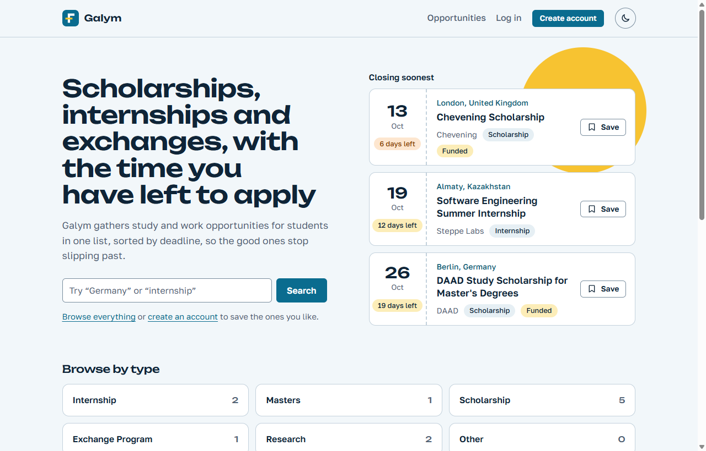
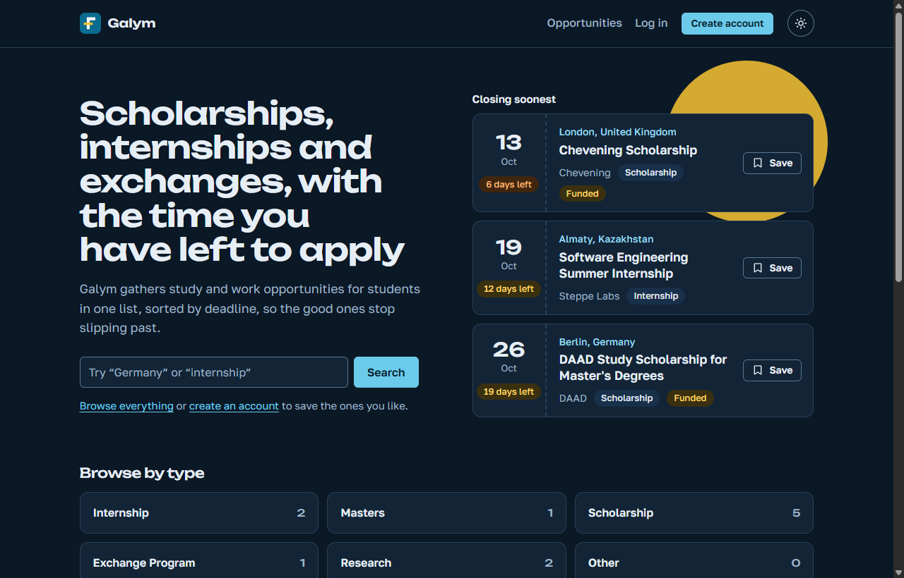

# Galym

Galym is a web platform that gathers scholarships, internships, research positions and exchange programmes in one searchable list, and shows how many days are left to apply to each. The name is the Kazakh word for "scholar" (ғалым).

Admins curate the listings. Visitors browse and search without an account; signing in lets them save opportunities to their profile.

| Light | Dark |
| ----- | ---- |
|  |  |

## What it does

- **Browse and search**: keyword search plus filters for type, country, city and funding. Results are sorted by deadline or by date added, and the filters live in the URL so a search can be shared.
- **Deadlines first**: every listing shows its closing date and a days-left counter that changes colour as the date gets near. Listings past their deadline drop out of the public list.
- **Accounts**: register, log in, save opportunities, edit your name and change your password.
- **Admin area**: create, edit, publish, unpublish and delete opportunities; change user roles and remove accounts.
- **Light and dark themes**, following the system setting until you pick one.

## Tech stack

| Part     | Folder             | Built with                                                        |
| -------- | ------------------ | ----------------------------------------------------------------- |
| Backend  | `galym_community/` | Java 21, Spring Boot 4, Spring Security (JWT), JPA, Flyway        |
| Frontend | `galym_frontend/`  | React 19, Vite, React Router, plain CSS (no UI library)           |
| Database | Docker             | PostgreSQL 17                                                     |

## Quick start

You need [Docker Desktop](https://www.docker.com/products/docker-desktop/) and, for the helper commands, [Node.js](https://nodejs.org/) 20 or newer.

1. Create your local settings. Copy `.env.example` to `.env`, then open `.env` and set `POSTGRES_PASSWORD` and `JWT_SECRET` before going on (the file explains how to generate both).

   ```bash
   cp .env.example .env        # Windows cmd: copy .env.example .env
   ```

2. Start the database, the API and the website. `--wait` returns once the API is ready, which the next step needs.

   ```bash
   docker compose up --build -d --wait
   ```

3. Load sample data. Optional, and safe to repeat.

   ```bash
   npm run seed
   ```

Then open:

- Website: http://localhost:5173
- API: http://localhost:8080

The first build downloads dependencies and takes a few minutes; later starts take seconds.

To stop everything: `docker compose down`. Add `-v` to also delete the database.

The database password is only read when the database is first created. If you change `POSTGRES_PASSWORD` (or the database name or user) later, run `docker compose down -v` and start again.

### Sample data and demo accounts

`npm run seed` runs [db/seed.sql](db/seed.sql) against the running database. It adds twelve opportunities and two accounts:

| Role  | Email               | Password     |
| ----- | ------------------- | ------------ |
| Admin | `admin@galym.local` | `admin12345` |
| User  | `user@galym.local`  | `user12345`  |

It only adds what is missing, so it is safe to run again. Deadlines are counted from the day a row is added, and a later run moves any sample deadline that has passed forward, so the list does not empty out. The programme names are real, but the dates and details are illustrative.

These passwords are public. Never run the seed against a database that real people use.

### Making someone an admin

New accounts are regular users. An admin can promote them under **Admin → Users**. To create the first admin without the seed:

```bash
docker compose exec db psql -c "UPDATE users SET role = 'ADMIN' WHERE email = 'you@example.com';"
```

## Working on the code

### Frontend with live reload

Keep the database and API running in Docker and start the Vite dev server instead of the built website:

```bash
docker compose up -d db backend
cd galym_frontend
npm install
npm run dev
```

The dev server uses port 5173, the same one as the Docker website, so stop that container first: `docker compose stop frontend`.

In development React runs every effect twice on purpose (`StrictMode`), so each request appears twice in the network tab. The production build sends it once.

### Backend without Docker

You need JDK 21. Keep the database in Docker and stop the Docker copy of the API, which uses the same port:

```bash
docker compose up -d db
docker compose stop backend
cd galym_community
./mvnw spring-boot:run        # Windows cmd: mvnw spring-boot:run
```

The backend reads the same root `.env` file. Its `SPRING_DATASOURCE_URL` points at the Docker database, which is published on port 5433 of your machine.

### Lint, format and tests

From the repo root:

```bash
npm --prefix galym_frontend install   # once, to get ESLint and Prettier

npm run lint      # ESLint + Prettier check (frontend), Checkstyle + Spotless check (backend)
npm run format    # rewrite files with Prettier (frontend) and Spotless (backend)
```

The backend half runs Maven inside Docker, so it needs Docker running but no local JDK.

Backend tests need a PostgreSQL to talk to. CI provides one; locally, with JDK 21 and the Docker database running (`docker compose up -d db`):

```bash
cd galym_community
./mvnw verify      # Windows cmd: mvnw verify
```

The tests run against the database from `.env` and remove what they create.

Every push runs the same checks in GitHub Actions ([.github/workflows/ci.yml](.github/workflows/ci.yml)): frontend lint, format check and build; backend format check, lint and tests.

## Configuration

Every setting is an environment variable, documented in [.env.example](.env.example). Docker Compose, the backend and Vite all read the root `.env`. Nothing secret is committed.

| Variable               | What it is for                                              |
| ---------------------- | ----------------------------------------------------------- |
| `POSTGRES_DB`, `POSTGRES_USER`, `POSTGRES_PASSWORD` | Database name and login            |
| `JWT_SECRET`           | Signs login tokens. Changing it logs everyone out.          |
| `CORS_ALLOWED_ORIGINS` | Website addresses allowed to call the API                   |
| `APP_TIMEZONE`         | Time zone that decides when a deadline day ends             |
| `SPRING_DATASOURCE_URL` | Database address for a backend running outside Docker      |
| `VITE_API_URL`         | Where the browser finds the API                             |

The website is published on port 5173 and the API on 8080. If you change those in `docker-compose.yml`, change `CORS_ALLOWED_ORIGINS` and `VITE_API_URL` to match.

## Database changes

The schema is managed by Flyway. To change it, add a new `V<n>__description.sql` file in `galym_community/src/main/resources/db/migration/`. Never edit a migration that has already run somewhere.

## Project layout

```
galym_community/          Spring Boot API
  src/main/java/next/galym_community/
    controller/           HTTP endpoints
    service/              business rules
    repository/           database queries
    entity/, dto/         database rows and request/response shapes
    security/, config/    JWT filter, access rules, CORS
  src/main/resources/db/migration/   Flyway migrations
galym_frontend/           React website
  src/pages/              one file per screen
  src/components/         shared pieces (ticket, navbar, forms)
  src/api/                calls to the backend
  src/context/            who is signed in and what they saved
  src/index.css           the design system: colours, type, components
db/seed.sql               sample data
docker-compose.yml        the local stack
```

## API overview

| Route                                    | Who       | What                                     |
| ---------------------------------------- | --------- | ---------------------------------------- |
| `POST /auth/register`, `POST /auth/login` | anyone   | create an account, get a token           |
| `GET /galym`, `GET /galym/{id}`          | anyone    | published opportunities, with filters    |
| `GET /users/me`, `PATCH /users/me`       | signed in | read and rename your account             |
| `PUT /users/me/password`                 | signed in | change your password                     |
| `GET/PUT/DELETE /users/me/saved[/{id}]`  | signed in | saved opportunities                      |
| `/admin/galym/**`                        | admin     | create, edit, publish, delete            |
| `/admin/user/**`                         | admin     | list users, change roles, delete         |

`GET /galym` accepts `q` (keyword), `type`, `country`, `city`, `organizationName` and `hasScholarship`. Text filters match part of a word and ignore case.

An opportunity is called `Galym` in the backend code and "opportunity" in the website.
